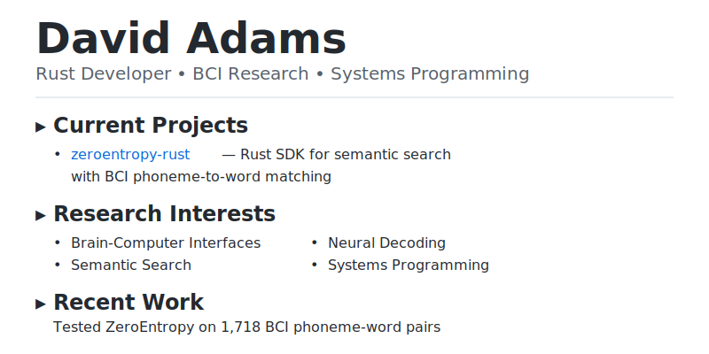

# GitHub Profile README Setup

## Step 1: Create the Repository

1. Go to https://github.com/new
2. **Repository name:** `davidatoms` (must match your username exactly)
3. **Description:** "My GitHub profile"
4. **Visibility:** Public
5. Check "Add a README file"
6. Click "Create repository"

## Step 2: Upload Files

Navigate to your new repository and upload these files:

```
davidatoms/
├── README.md (replace the auto-generated one)
├── light_mode.svg
└── dark_mode.svg
```

## Step 3: Commit the Files

```bash
cd davidatoms
git init
git add README.md light_mode.svg dark_mode.svg
git commit -m "Add theme-aware profile README"
git branch -M main
git remote add origin https://github.com/davidatoms/davidatoms.git
git push -u origin main
```

Or upload directly through GitHub web interface:
1. Click "Add file" → "Upload files"
2. Drag and drop the three files
3. Commit with message: "Add theme-aware profile README"

## Step 4: Verify

1. Visit your profile: https://github.com/davidatoms
2. You should see the custom README
3. Toggle between light/dark mode to see the theme switch

## Features

✓ **Theme-aware:** Automatically switches between light and dark mode based on user preference
✓ **Monochrome symbols:** Uses `▸` and `•` for clean, professional look
✓ **Featured project:** Highlights zeroentropy-rust with BCI work
✓ **GitHub stats:** Shows contribution statistics (optional)

## Customization

### Update SVGs

To change the content, edit `light_mode.svg` and `dark_mode.svg`:
- Change text content in `<text>` elements
- Adjust colors in the `<style>` section
- Modify layout by changing `x` and `y` coordinates

### Update README

Edit `README.md` to:
- Add more projects
- Update skills and interests
- Change statistics theme
- Add new sections

### Color Schemes

**Light Mode Colors:**
- Background: `#ffffff`
- Text: `#24292f`
- Subtitle: `#57606a`
- Links: `#0969da`
- Divider: `#d0d7de`

**Dark Mode Colors:**
- Background: `#0d1117`
- Text: `#f0f6fc`
- Subtitle: `#8b949e`
- Links: `#58a6ff`
- Divider: `#30363d`

## Alternative Symbols

If you want to change the symbols, here are alternatives:

**Section Headers:**
- `▸` (current)
- `►`
- `▶`
- `→`
- `⇒`

**List Bullets:**
- `•` (current)
- `◦`
- `▪`
- `─`
- `‣`

## Troubleshooting

**SVGs not showing:**
- Wait a few minutes for GitHub to cache the files
- Ensure files are in the `main` branch
- Check that URLs in README match your repository

**Wrong theme showing:**
- Clear browser cache
- Check your GitHub theme settings
- Verify `prefers-color-scheme` media query

**Want to preview locally:**
```bash
# Open in browser with dark mode:
# Use browser DevTools to toggle prefers-color-scheme

# Or use this simple HTML:
echo '<picture>
  <source media="(prefers-color-scheme: dark)" srcset="dark_mode.svg">
  
</picture>' > preview.html
```

## Next Steps

1. Pin your best repositories to your profile
2. Add topics to your repositories
3. Enable GitHub Discussions on key repos
4. Keep the "Recent Work" section updated
